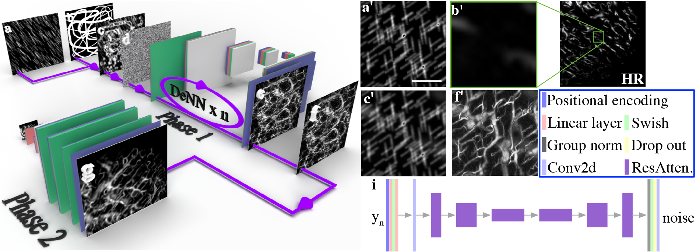
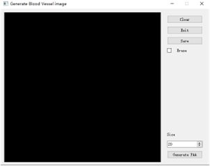
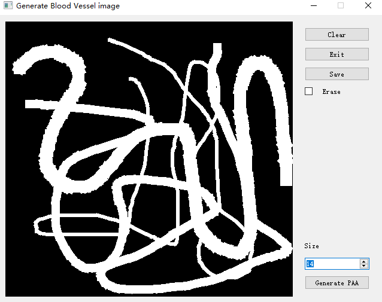
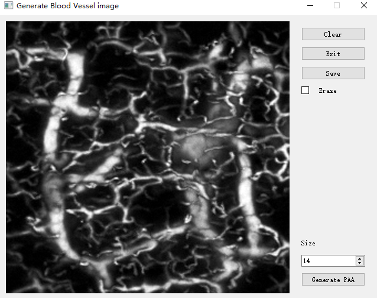
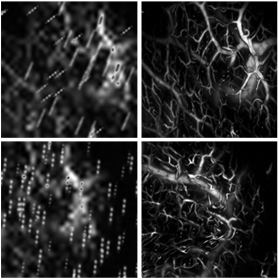
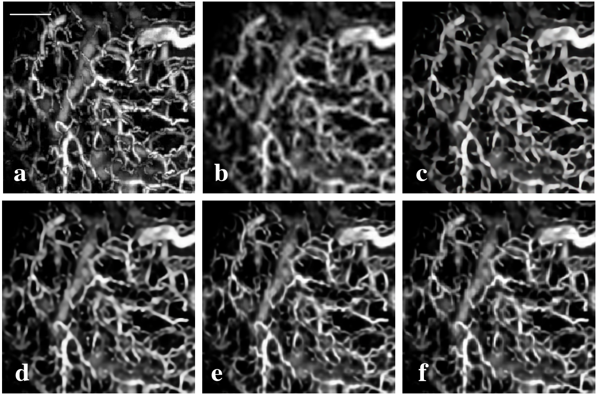

# Super-Resolution Photoacoustic Angiopgraphy Assisted by Images Forged from Hand-Drawn Graffiti🚀🚀🚀🚀🚀

[Paper]( ) |  [Project](https://github.com/yuanzhengthu/handDrawnPAAImages)


## 🚀Brief
This is the PyQt implementation about **Super-Resolution Photoacoustic Angiopgraphy Assisted by Images Forged from Hand-Drawn Graffiti**.
The project is based on **Image Super-Resolution via Iterative Refinement** | [Project](https://iterative-refinement.github.io/ ). 


Our project is coded with PyQt5. One can draw graffiti on the board and generate its photoacoustic version within few minutes.

## 🚀How to use


```
# first download model from Google Drive, and put it into ./experiments
# https://drive.google.com/file/d/1XWXWG4DAw0ZPd0N_3r-7jQMF5WMKyOG0/view?usp=share_link
cd dir_of_the_project
python ./main.py
```
## 🚀Schematic
 

## 🚀GUI snapshot
*Note:* **PyQt5-based hand-drawn graffiti for photoacoustic images generation**. The GUI with graffiti and without graffiti are shown below.

 
 


## 🚀Results
### Forging realistic photoacoustic images.
*Note:* We generate different kinds of photoacoustic images by adding some noise of gaussian distribution.
As shown below, one can forge realistic photoacoustic images from the same graffiti with overlapping different noises.


 

**The left two are input images while the right are their photoacoustic version.**

### * 🚀Photoacoustic image super-resolution
*Note:* The shallow and deep feature extraction of SwinIR enables us to utilize the self-similarity of blood vessel images.
These results also prove the abilities of our proposed method in forging photoacoustic images.

 

**(a) high-resolution ground truth; (b) reconstructed by Bicubic algorithm; and (c)-(f) reconstructed by SwinIR trained with (c) COCO dataset; (d) mouse brain PAA images; (e) real human lips PAA images; (f) forged human lips PAA images.**
