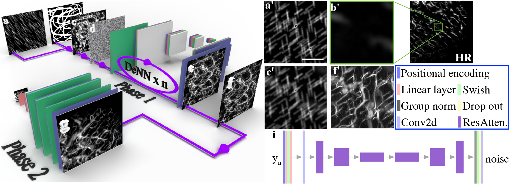
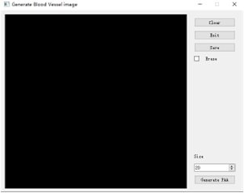
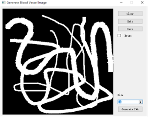
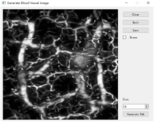
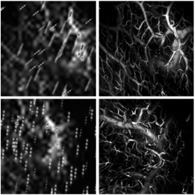
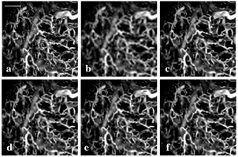

## 🚀🚀🚀 We're thrilled to announce that our paper has been accepted for publication in *Medical Image Analysis*!
# DOVE: Doodled Vessel Enhancement for Photoacoustic Angiography Super Resolution


[Paper](https://www.sciencedirect.com/science/article/abs/pii/S1361841524000318) | [Project](https://github.com/yuanzhengthu/handDrawnPAAImages)

## 🚀 Brief
This project presents a PyQt implementation for **Super-Resolution Photoacoustic Angiography Assisted by Images Forged from Hand-Drawn Graffiti**. 
Leveraging the concept of **Image Super-Resolution via Iterative Refinement** [Project](https://iterative-refinement.github.io/), 
our application allows users to draw graffiti on a board, generating its corresponding photoacoustic version within minutes. 
The implementation is coded using PyQt5.

## 🚀 How to Use


```
# First, download the model from Google Drive and place it in ./experiments
# [Google Drive Model](https://drive.google.com/file/d/1XWXWG4DAw0ZPd0N_3r-7jQMF5WMKyOG0/view?usp=share_link)
cd dir_of_the_project
python ./main.py

```
## 🚀Schematic
 

**(a)-(g): The schematic illustrates the training process for super-resolution blood vessel images in Photoacoustic Angiography (PAA) forged from hand-drawn doodles. It includes steps such as generating rain-like noise, hand-drawn doodles, input image generation, normalized Gaussian noise, PAA image generation, normalized PAA image, and reconstructed super-resolution PAA image. (a')-(f'): The corresponding schematic for training super-resolution blood vessel images in PAA forged from cropped images.**

## 🚀GUI snapshot
*Note:* **PyQt5-based hand-drawn graffiti for photoacoustic images generation. The GUI with graffiti and without graffiti is displayed below.**

 
 


## 🚀Results
### Forging realistic photoacoustic images.
*Note:* We generate different kinds of photoacoustic images by adding noise of Gaussian distribution. 
The left two are input images, while the right two are their corresponding photoacoustic versions.


 

**The left two are input images while the right are their photoacoustic version.**

### * 🚀Photoacoustic image super-resolution
*Note:* The shallow and deep feature extraction of SwinIR enables us to utilize the self-similarity of blood vessel images.
These results also prove the abilities of our proposed method in forging photoacoustic images.

 

**(a) High-resolution ground truth; (b) Reconstructed by Bicubic algorithm; (c)-(f) Reconstructed by SwinIR trained with various datasets. (c) COCO dataset; (d) mouse brain PAA images; (e) real human lips PAA images; (f) forged human lips PAA images.**
